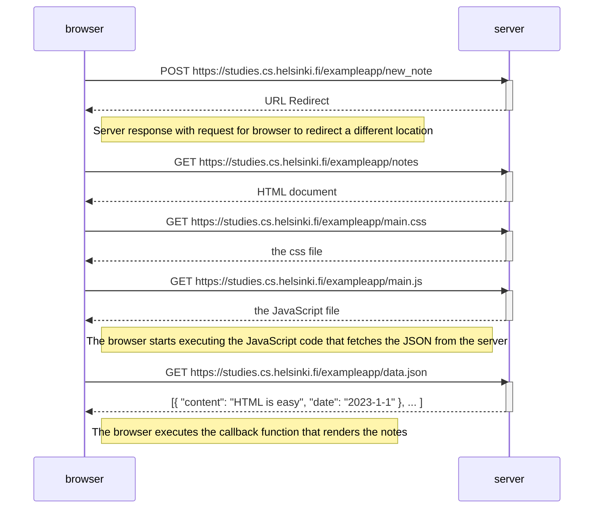
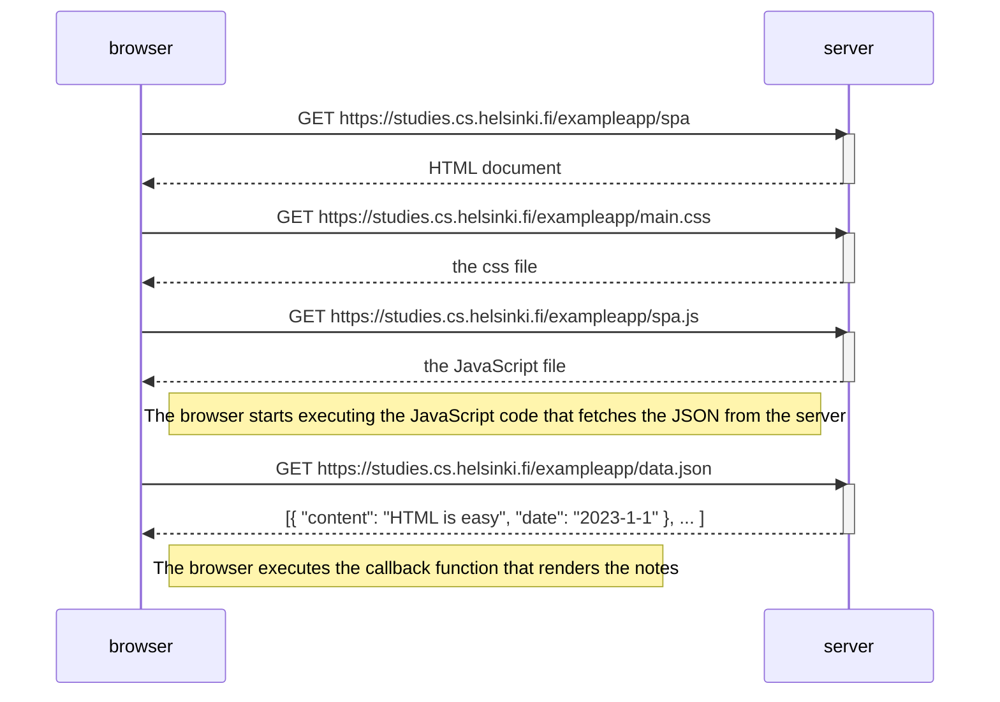
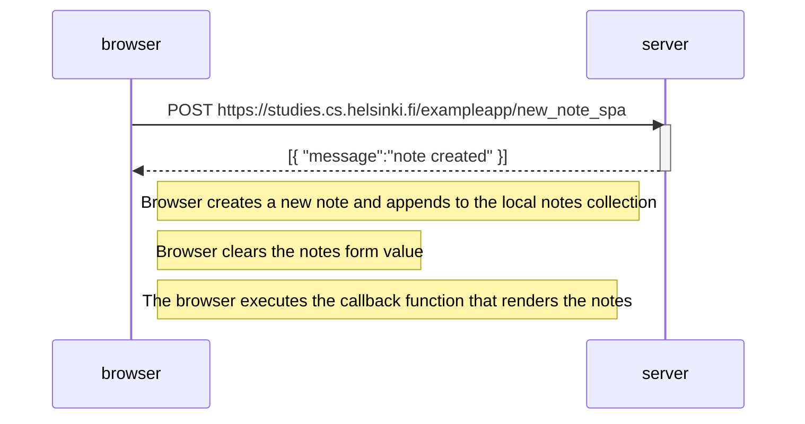

# Part 0b Exercises

## 0.1: HTML

- [x] Review the [Mozilla HTML tutorial](https://developer.mozilla.org/en-US/docs/Learn/Getting_started_with_the_web/HTML_basics)

## 0.2: CSS

- [x] Review the [Mozilla CSS tutorial](https://developer.mozilla.org/en-US/docs/Learn/Getting_started_with_the_web/CSS_basics)

## 0.3: HTML forms

- [x] Review the [Mozilla forms tutorial](https://developer.mozilla.org/en-US/docs/Learn/HTML/Forms/Your_first_HTML_form)

## 0.4: New note diagram

## 0.5: Single page app diagram

## 0.6: New note in Single page app diagram

